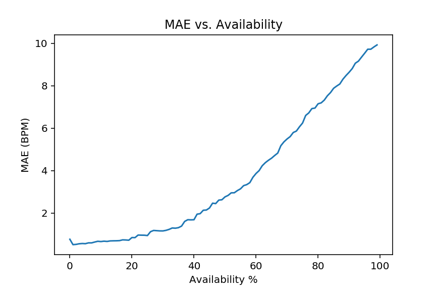

# Activity Aware Pulse Rate Algorithm Project

## Introduction
A core feature that many users expect from their wearable devices is pulse rate estimation. Continuous pulse rate estimation can be informative for many aspects of a wearer's health. Pulse rate during exercise can be a measure of workout intensity and resting heart rate is sometimes used as an overall measure of cardiovascular fitness. I created a pulse rate estimation algorithm for a wrist-wearable device.

This project has 2 main parts:

- [Part 1](https://github.com/iDataist/Motion-Compensated-Pulse-Rate-Estimation/blob/master/part_1/pulse_rate.ipynb) - I developed a **Pulse Rate Algorithm** on the given training data.
- [Part 2](https://github.com/iDataist/Motion-Compensated-Pulse-Rate-Estimation/blob/master/part_2/clinical_app.ipynb) - I computed clinically meaningful features and discover healthcare trends.

## Physiological Mechanics of Pulse Rate Estimation
Pulse rate is typically estimated by using the PPG sensor. When the ventricles contract, the capilaries in the wrist fill with blood. The (typically green) light emitted by the PPG sensor is absorbed by red blood cells in these capilaries and the photodetector will see the drop in reflected light. When the blood returns to the heart, fewer red blood cells in the wrist absorb the light and the photodetector sees an increase in reflected light. The period of this oscillating waveform is the pulse rate.

However, the heart beating is not the only phenomenon that modulates the PPG signal. Blood in the wrist is fluid, and arm movement will cause the blood to move correspondingly. During exercise, like walking or running, we see another periodic signal in the PPG due to this arm motion. The pulse rate estimator needs to distinguish this periodic signal from the pulse rate.

I used the accelerometer signal of the wearable device to help keep track of which periodic signal is caused by motion. Because the accelerometer is only sensing arm motion, any periodic signal in the accelerometer is likely not due to the heart beating, and only due to the arm motion. If the pulse rate estimator is picking a frequency that's strong in the accelerometer, it may be making a mistake.

All estimators will have some amount of error. How much error is tolerable depends on the application. If using these pulse rate estimates to compute long term trends over months, then I may be more robust to higher error variance. However, if I wanted to give information back to the user about a specific workout or night of sleep, I would require a much lower error.

## Algorithm Confidence and Availability
Many machine learning algorithms produce outputs that can be used to estimate their per-result error. For example in logistic regression you can use the predicted class probabilities to quantify trust in the classification. A classification where one class has a very high probability is probably more accurate than one where all classes have similar probabilities. Certainly, this method is not perfect and won't perfectly rank-order estimates based on error. But if accurate enough, it allows consumers of the algorithm more flexibility in how to use it. I call this estimation of the algorithms error the *confidence*.

In pulse rate estimation, having a confidence value can be useful if a user wants just a handful of high-quality pulse rate estimate per night. They can use the confidence algorithm to select the 20 most confident estimates at night and ignore the rest of the outputs. Confidence estimates can also be used to set the point on the error curve that I want to operate at by sacrificing the number of estimates that are considered valid. There is a trade-off between *availability* and error. For example if I want to operate at 10% availability, I look at the training dataset to determine the threshold for which 10% of the estimates pass. Then if only an estimate's confidence value is above that threshold do I consider it valid. See the error vs. availability curve below.

This plot is created by computing the mean absolute error at all -- or at least 100 of -- the confidence thresholds in the dataset.

Building a confidence algorithm for pulse rate estimation is a little tricker than logistic regression because intuitively there isn't some transformation of the algorithm output that can make a good confidence score. However, by understanding the algorithm behavior I can come up with some general ideas that might create a good confidence algorithm. For example, if the algorithm is picking a strong frequency component that's not present in the accelerometer I can be relatively confidence in the estimate.

## Citations
1. **Troika** - Zhilin Zhang, Zhouyue Pi, Benyuan Liu, ‘‘TROIKA: A General Framework for Heart Rate Monitoring Using Wrist-Type Photoplethysmographic Signals During Intensive Physical Exercise,’’IEEE Trans. on Biomedical Engineering, vol. 62, no. 2, pp. 522-531, February 2015. Link
2. **CAST RR Interval Sub-Study Database Citation** - Stein PK, Domitrovich PP, Kleiger RE, Schechtman KB, Rottman JN. Clinical and demographic determinants of heart rate variability in patients post myocardial infarction: insights from the Cardiac Arrhythmia Suppression Trial (CAST). Clin Cardiol 23(3):187-94; 2000 (Mar)
3. **Physionet Citation** - Goldberger AL, Amaral LAN, Glass L, Hausdorff JM, Ivanov PCh, Mark RG, Mietus JE, Moody GB, Peng C-K, Stanley HE. PhysioBank, PhysioToolkit, and PhysioNet: Components of a New Research Resource for Complex Physiologic Signals (2003). Circulation. 101(23):e215-e220.
